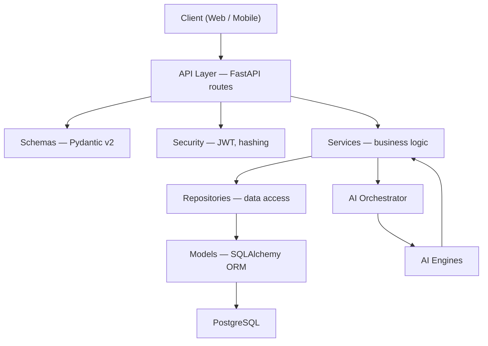
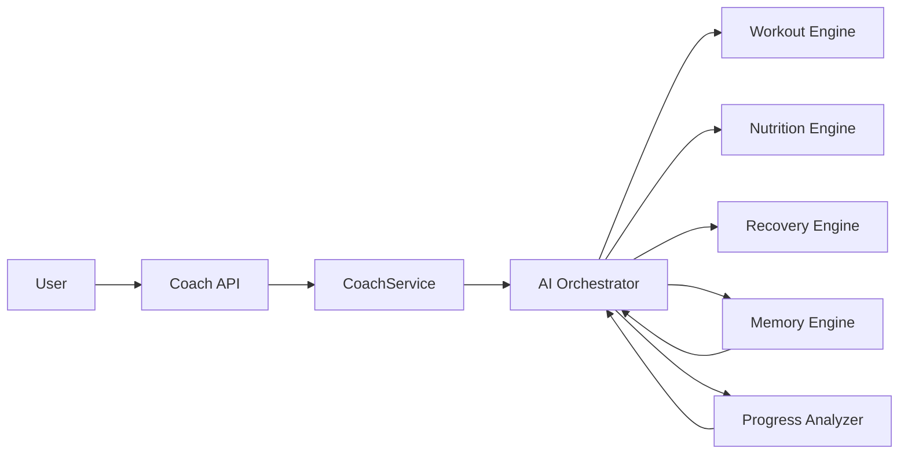
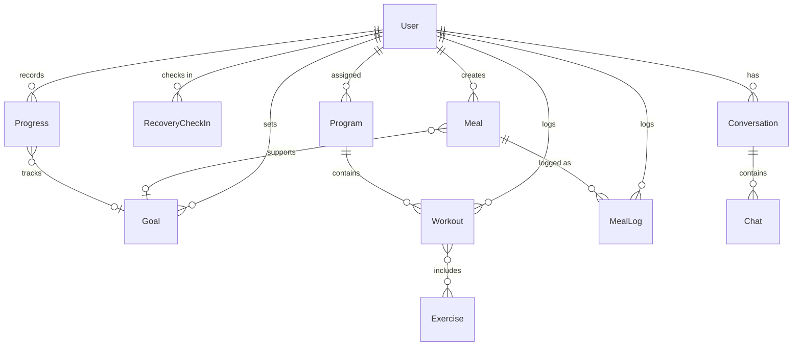
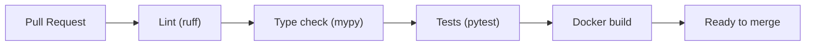
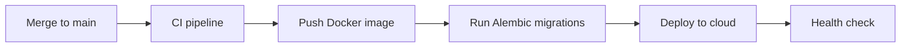

# EVOLVE Architecture

> **Document version:** 1.0  
> **Status:** Living architecture reference  
> **Audience:** Engineering, product, and operations

---

# 1 Vision

EVOLVE is an **AI-first fitness coaching platform** designed to deliver personalized, adaptive guidance across training, nutrition, and recovery. Unlike static workout apps or generic chatbots, EVOLVE combines structured fitness domain knowledge with intelligent automation to act as a continuous coach — not a one-off recommendation engine.

## What EVOLVE Is

EVOLVE helps users reach their health and performance goals through:

- **Personalized workout programming** that adapts to ability, equipment, schedule, and progress.
- **Nutrition guidance** aligned with goals, preferences, and training load.
- **Recovery awareness** that factors in fatigue, sleep, and readiness.
- **Long-term memory** of user history, preferences, injuries, and outcomes.
- **Progress analysis** that turns logged data into actionable coaching decisions.

## Long-Term Vision

The long-term vision for EVOLVE is to become a **trusted digital coach** that users interact with daily — through conversation, structured plans, and real-time adjustments — while the platform maintains a complete picture of their fitness journey.

Over time, EVOLVE will:

1. **Unify coaching** behind a single AI Coach persona so users never navigate fragmented tools or conflicting advice.
2. **Learn continuously** from user behavior, feedback, and outcomes to improve recommendations over weeks and months.
3. **Scale from individuals to teams** — supporting personal users first, then coaches managing multiple clients.
4. **Integrate with the real world** — wearables, gym equipment, meal logging, and calendar data — without sacrificing simplicity.
5. **Operate as a production-grade platform** with secure auth, reliable APIs, observable infrastructure, and mobile-first access.

EVOLVE is built for longevity: a modular backend, explicit domain boundaries, and AI engines that can evolve independently as models and product requirements change.

---

# 2 Architecture

EVOLVE follows **Clean Architecture** with a strict separation of concerns. HTTP handling, business logic, persistence, and AI orchestration live in distinct layers. Dependencies flow inward: outer layers depend on inner abstractions, never the reverse.

## Architectural Principles

| Principle | Application |
|-----------|-------------|
| **Thin routes** | API endpoints validate input, call services, and return responses — no business logic in routes. |
| **Services own logic** | All domain rules, orchestration, and cross-entity workflows live in the service layer. |
| **Repositories own persistence** | Database reads and writes are isolated behind repository interfaces. |
| **AI is isolated** | AI modules are invoked by services or an orchestrator — never directly from API routes. |
| **Type safety** | Python type hints and Pydantic schemas are mandatory across public interfaces. |
| **Stateless API** | JWT-based authentication enables horizontal scaling of API instances. |

## Layer Overview



---

## FastAPI

**Role:** HTTP API gateway and application entrypoint.

FastAPI exposes versioned REST endpoints under `/api/v1/`. It handles:

- Request parsing and response serialization
- Dependency injection (`get_db`, `get_current_user`)
- OpenAPI documentation (`/docs`, `/redoc`)
- Middleware (CORS, request logging, error handling)
- Application lifecycle (startup/shutdown hooks)

Routes are organized by domain (auth, users, workouts, nutrition, coach, progress). Each route delegates immediately to a service method.

**Current state:** A health endpoint exists at `GET /`. Full API surface is planned.

---

## SQLAlchemy

**Role:** Object-Relational Mapping (ORM) for PostgreSQL.

SQLAlchemy 2.x maps Python model classes to database tables. It provides:

- Declarative model definitions in `models/`
- Session management via a request-scoped `Session` dependency
- Relationship mapping between entities (users, programs, workouts, etc.)
- Query construction inside repositories only

Models define structure; they do not contain business logic. All queries run through repositories to keep the ORM layer swappable and testable.

---

## PostgreSQL

**Role:** Primary transactional data store.

PostgreSQL holds all durable application data:

- User accounts and profiles
- Workout and nutrition catalogs
- Assigned programs and logged sessions
- Goals, progress metrics, and chat history
- AI memory snapshots and coaching context

PostgreSQL is chosen for ACID guarantees, rich indexing, JSON support for flexible metadata, and strong ecosystem tooling. It runs locally via Docker Compose during development and as a managed service in production.

---

## Alembic

**Role:** Database schema migration management.

Alembic tracks every schema change as a versioned migration. It provides:

- Reproducible schema evolution across environments
- Rollback capability for failed deployments
- A single source of truth for database structure (replacing ad-hoc `create_all()` in production)

Migrations are generated from SQLAlchemy model changes, reviewed in pull requests, and applied automatically in CI/CD pipelines before or during deployment.

---

## JWT

**Role:** Stateless authentication and authorization.

EVOLVE uses JSON Web Tokens for API authentication:

- **Access tokens** — short-lived, sent with each request in the `Authorization` header.
- **Refresh tokens** — longer-lived, used to obtain new access tokens without re-login.

The `security/` module handles token creation, validation, and password hashing. FastAPI dependencies extract the current user from a valid token and enforce role-based access where needed (e.g., coach vs. client).

JWT enables horizontal API scaling without server-side session storage.

---

## Services

**Role:** Business logic and orchestration.

Services implement domain rules and coordinate workflows. Examples:

- `AuthService` — registration, login, token refresh
- `UserService` — profile management, preferences
- `WorkoutService` — program assignment, session logging
- `NutritionService` — meal plan management
- `RecoveryService` — readiness check-ins and daily readiness scoring
- `CoachService` — conversational coaching via the AI Orchestrator
- `ProgressService` — metric aggregation and trend detection

Services may call multiple repositories and AI modules. They are the only layer that composes cross-domain operations. Services are unit-tested with mocked repositories and AI interfaces.

---

## Repositories

**Role:** Data access abstraction.

Repositories encapsulate all database operations for a single aggregate or entity group:

- `UserRepository` — CRUD and lookup by email
- `ExerciseRepository` — catalog queries
- `ProgramRepository` — program and assignment persistence
- `WorkoutRepository` — session logs
- `MealRepository` — meal and plan storage
- `RecoveryCheckInRepository` — daily readiness check-ins
- `ProgressRepository` — metric snapshots
- `ChatRepository` — message history

Repositories accept a SQLAlchemy `Session` and return model instances or domain-friendly structures. No HTTP or AI logic belongs here.

---

## Schemas

**Role:** Request/response validation and API contracts.

Pydantic v2 schemas define the public API shape:

- **Request schemas** — validate incoming data (`UserCreate`, `WorkoutLogCreate`)
- **Response schemas** — serialize outbound data (`UserRead`, `ProgramRead`)
- **Internal DTOs** — transfer data between services when needed

Schemas never expose sensitive fields (e.g., password hashes). They are separate from SQLAlchemy models to keep the API contract independent of the database schema.

---

## AI Modules

**Role:** Specialized intelligence for coaching domains.

AI modules live under `backend/app/ai/` and top-level `ai/`. Each engine owns a specific coaching capability. They expose clear input/output contracts (Pydantic models) and are invoked by the **AI Orchestrator** or domain services.

AI modules must remain decoupled from FastAPI routes. This allows:

- Independent testing and versioning of AI logic
- Future extraction to dedicated worker processes or GPU-backed services
- Model swaps without API contract changes

---

# 3 Folder Structure

EVOLVE is a **monorepo** organized by concern. Below is the complete folder layout — existing directories and planned additions.

```
EVOLVE/
├── .cursor/
│   └── rules/
│       ├── evolve.mdc                  # Cursor AI coding rules
│       └── EVOLVE_ARCHITECTURE.md      # This document
│
├── backend/                            # FastAPI application
│   ├── Dockerfile                      # Backend container image
│   ├── requirements.txt                # Python dependencies
│   ├── alembic/                        # Alembic migrations (future)
│   │   ├── versions/                   # Migration scripts
│   │   └── env.py                      # Alembic environment config
│   ├── alembic.ini                     # Alembic configuration (future)
│   ├── tests/                          # pytest test suite
│   │   ├── unit/                       # Unit tests (services, utils)
│   │   ├── integration/                # API and DB integration tests
│   │   └── conftest.py                 # Shared fixtures
│   └── app/
│       ├── __init__.py
│       ├── main.py                     # FastAPI application entrypoint
│       │
│       ├── api/                        # HTTP route handlers (versioned)
│       │   └── v1/
│       │       ├── auth.py
│       │       ├── users.py
│       │       ├── workouts.py
│       │       ├── nutrition.py
│       │       ├── coach.py
│       │       └── progress.py
│       │
│       ├── core/                       # Application configuration
│       │   ├── config.py               # Settings (env, secrets)
│       │   └── dependencies.py         # Shared FastAPI dependencies
│       │
│       ├── db/                         # Database infrastructure
│       │   ├── base.py                 # Model registration for Alembic
│       │   └── database.py             # Engine, session factory
│       │
│       ├── models/                     # SQLAlchemy ORM models
│       │   ├── user.py
│       │   ├── exercise.py
│       │   ├── program.py
│       │   ├── workout.py
│       │   ├── meal.py
│       │   ├── progress.py
│       │   ├── goal.py
│       │   └── chat.py
│       │
│       ├── repositories/               # Data access layer
│       │   ├── user_repository.py
│       │   ├── exercise_repository.py
│       │   ├── program_repository.py
│       │   ├── workout_repository.py
│       │   ├── meal_repository.py
│       │   ├── progress_repository.py
│       │   ├── goal_repository.py
│       │   └── chat_repository.py
│       │
│       ├── schemas/                    # Pydantic request/response models
│       │   ├── auth.py
│       │   ├── user.py
│       │   ├── workout.py
│       │   ├── nutrition.py
│       │   ├── coach.py
│       │   └── progress.py
│       │
│       ├── services/                   # Business logic
│       │   ├── auth_service.py
│       │   ├── user_service.py
│       │   ├── workout_service.py
│       │   ├── nutrition_service.py
│       │   ├── coach_service.py
│       │   └── progress_service.py
│       │
│       ├── security/                   # Authentication and authorization
│       │   ├── jwt.py                  # Token creation and validation
│       │   ├── hashing.py              # Password hashing
│       │   └── dependencies.py         # get_current_user, role checks
│       │
│       ├── ai/                         # AI engines (backend-local)
│       │   ├── orchestrator.py         # AI Orchestrator — engines dict populated (Sprint 4.5);
│       │   │                           # LLM-fallback branch degrades gracefully on LLMProviderError
│       │   │                           # as of Sprint 4.6 (Decision 021)
│       │   ├── contracts.py            # Shared Pydantic types (Intent, MemoryContext, EngineInput/Output)
│       │   ├── engine.py               # AIEngine protocol — implemented by coach_engines.py (Sprint 4.5)
│       │   ├── intent.py               # classify_intent() — keyword stub (Sprint 4.2), upgraded in
│       │   │                           # Sprint 4.6 to LLM-primary with the original keyword matcher
│       │   │                           # kept as _classify_intent_by_keyword() fallback (Decision 024)
│       │   ├── llm_provider.py         # LLMProvider abstraction + MockLLMProvider (Sprint 4.2);
│       │   │                           # OpenAICompatibleLLMProvider + LLMProviderError added
│       │   │                           # Sprint 4.6 — real vendor via AI_PROVIDER=openai_compatible
│       │   │                           # (Decisions 020/021)
│       │   ├── memory_engine.py        # Memory Engine v1 (Sprint 4.2)
│       │   ├── coach_engines.py        # WorkoutCoachEngine/NutritionCoachEngine/RecoveryCoachEngine
│       │   │                           # (Sprint 4.5) — thin AIEngine adapters over the Services
│       │   │                           # below, registered into AIOrchestrator.engines (Decision 017);
│       │   │                           # closes out the Workout Engine deliverable conceptually
│       │   │                           # (Decision 006 satisfied the rule-based half via
│       │   │                           # WorkoutResolutionService; this adapter is its Coach binding)
│       │   ├── nutrition_engine.py     # Nutrition Engine (Sprint 4.3) — rule-based, decoupled
│       │   │                           # from the Orchestrator (Decision 011); see bmr_strategies.py
│       │   │                           # and nutrition_constants.py alongside it
│       │   ├── bmr_strategies.py       # BMRStrategy ABC + MifflinStJeorBMRStrategy (Decision 013)
│       │   ├── nutrition_constants.py  # activity/protein/BMR-offset lookup tables (Sprint 4.3)
│       │   ├── recovery_engine.py      # Recovery Engine (Sprint 4.4) — rule-based, decoupled
│       │   │                           # from the Orchestrator (Decision 016); training load is
│       │   │                           # derived from WorkoutLog history, not self-reported
│       │   │                           # (Decision 014); see recovery_constants.py alongside it
│       │   ├── recovery_constants.py   # training-load reference values + readiness-level
│       │   │                           # guidance/protocol text (Sprint 4.4)
│       │   ├── progress_analyzer.py    # ProgressAnalyzer (Sprint 4.6) — hybrid deterministic stats +
│       │   │                           # LLM narrative, decoupled from the Orchestrator (Decisions
│       │   │                           # 022/023); see progress_constants.py alongside it
│       │   └── progress_constants.py   # fallback-narrative templates + plateau reference values
│       │                               # (Sprint 4.6)
│       │
│       └── utils/                      # Shared utilities
│           ├── datetime.py
│           └── pagination.py
│
├── ai/                                 # Standalone AI packages (future extraction)
│   ├── workout/
│   ├── nutrition/
│   ├── recovery/
│   ├── memory/
│   └── progress/
│
├── app/                                # Mobile application (Phase 5)
│   ├── ios/
│   ├── android/
│   └── shared/                         # Shared client logic (API client, models)
│
├── database/                           # Database utilities and seed data
│   ├── seeds/                          # Reference data (exercises, templates)
│   └── scripts/                        # Maintenance scripts
│
├── docker/                             # Additional Docker configurations
│   ├── docker-compose.prod.yml
│   └── docker-compose.dev.yml
│
├── docs/                               # Extended documentation
│   ├── api/                            # API guides
│   └── adr/                            # Architecture Decision Records
│
├── infrastructure/                     # Infrastructure as Code (Phase 6)
│   ├── terraform/                      # Cloud provisioning
│   └── kubernetes/                     # K8s manifests (if applicable)
│
├── scripts/                            # Developer and ops scripts
│   ├── setup.sh
│   └── migrate.sh
│
├── .env.example                        # Environment variable template
├── .gitignore
├── docker-compose.yml                  # Local development services
└── README.md                           # Project overview and quickstart
```

## Folder Responsibilities

| Folder | Purpose |
|--------|---------|
| `backend/app/api/` | HTTP endpoints only — thin controllers |
| `backend/app/core/` | Configuration, settings, shared dependencies |
| `backend/app/db/` | Database engine, session management, base metadata |
| `backend/app/models/` | SQLAlchemy table definitions |
| `backend/app/repositories/` | All database queries |
| `backend/app/schemas/` | Pydantic validation and serialization |
| `backend/app/services/` | Business rules and workflow orchestration |
| `backend/app/security/` | JWT, password hashing, auth dependencies |
| `backend/app/ai/` | AI engines and orchestrator |
| `backend/app/utils/` | Stateless helper functions |
| `backend/tests/` | Automated test suite |
| `ai/` | Independently deployable AI packages (future) |
| `app/` | Mobile client codebase |
| `database/` | Seed data and DB maintenance tooling |
| `docker/` | Environment-specific Compose files |
| `docs/` | Human-readable documentation beyond this file |
| `infrastructure/` | Cloud and deployment provisioning |
| `scripts/` | Automation for local dev and CI |

---

# 4 AI Architecture

## The AI Coach Experience

EVOLVE presents users with **one Coach** — a unified conversational interface that feels like a single intelligent trainer. Behind the scenes, multiple specialized engines collaborate, but the user never selects engines, switches modes, or receives fragmented responses.

The Coach:

- Answers questions about training, nutrition, and recovery in natural language
- Generates and adjusts plans based on user context
- Remembers past conversations, preferences, and outcomes
- Proactively suggests changes when progress stalls or readiness drops

## AI Orchestrator

The **AI Orchestrator** is the central coordination layer for all AI operations. It sits between `CoachService` and the individual engines.



### Orchestrator Responsibilities

1. **Intent classification** — Determine what the user needs (workout change, meal suggestion, recovery advice, progress review).
2. **Context assembly** — Pull user profile, active programs, recent logs, goals, and memory via services and the Memory Engine.
3. **Engine routing** — Invoke one or more engines based on intent and context.
4. **Response synthesis** — Merge engine outputs into a single, coherent Coach reply.
5. **Persistence** — Store conversation turns and any generated artifacts (plans, adjustments) via repositories.

The Orchestrator does not contain domain algorithms. It coordinates; engines compute.

**Current state (Sprint 4.5):** the Orchestrator, Memory Engine v1, and `Conversation`/`ChatMessage` persistence exist and are exercised end to end, and `AIOrchestrator.engines` now has all three existing engines registered — `Intent.WORKOUT`/`Intent.NUTRITION`/`Intent.RECOVERY` route to `WorkoutCoachEngine`/`NutritionCoachEngine`/`RecoveryCoachEngine` (`app/ai/coach_engines.py`), thin `AIEngine` adapters over `WorkoutResolutionService`/`NutritionService`/`RecoveryService` — see Decision 017 in `docs/DECISIONS.md`. `Intent.GENERAL` and `Intent.PROGRESS` (no Progress Analyzer exists yet — Sprint 4.6) still fall through to a direct LLM completion via the provider-agnostic `LLMProvider` interface, backed for now by a deterministic `MockLLMProvider` (Decision 008); intent classification remains the keyword-matching stub (`app/ai/intent.py`) — a real classifier stays deferred to Sprint 4.6's LLM vendor decision (Decision 018). `EngineOutput.artifacts` is now persisted onto the assistant turn's metadata alongside `intent`/`engines_invoked`. `process_message` is the only `async def` in the backend — see Decision 009. The Coach is reachable via `CoachService`/`/api/v1/coach` (Decision 019) — `CoachService` is a thin application-layer wrapper (ownership check, then delegate to `process_message`); it contains no orchestration logic of its own.

**Current state (Sprint 4.6):** the `LLMProvider` abstraction is no longer mock-only — `get_llm_provider()` returns a real `OpenAICompatibleLLMProvider` (`app/ai/llm_provider.py`) when `AI_PROVIDER=openai_compatible`, backed by the official `openai` SDK's `AsyncOpenAI` client against any OpenAI-compatible `base_url` (OpenAI itself, Azure OpenAI, OpenRouter, or a local server); `MockLLMProvider` remains available for `AI_PROVIDER=mock` (tests, offline dev) — see Decision 020. Every SDK-level failure (timeout, auth, rate limit, connection error) is translated into a single `LLMProviderError`, and both `AIOrchestrator.process_message`'s LLM-fallback branch and `classify_intent` catch it to degrade gracefully — the Coach caller always gets a normal `200` response, never a raw 500/502 — see Decision 021. `classify_intent` (`app/ai/intent.py`) is upgraded from a pure keyword stub to LLM-primary: it now calls the real LLM to pick one of the five `Intent` labels first, falling back to the original keyword matcher (renamed `_classify_intent_by_keyword`, still directly unit-tested) on an `LLMProviderError` or an unparseable response; under `AI_PROVIDER=mock` this deterministically falls back to keyword matching every time, so `mock`-provider test behavior is unchanged — see Decision 024. `AIOrchestrator.process_message`'s one call site is now `intent = await classify_intent(message, self.llm_provider)`. `Intent.PROGRESS` still falls through to the (now real, resilient) LLM completion, exactly like `Intent.GENERAL` — the Progress Analyzer that landed this sprint (see below) ships decoupled from `AIOrchestrator.engines`, with its own `ProgressService`/`GoalService` and `/api/v1/progress`/`/api/v1/goals` REST APIs instead — see Decision 023.

---

## Workout Engine

**Purpose:** Generate, adapt, and explain workout programming.

**Inputs:**
- User profile (experience, injuries, equipment access)
- Active program and recent workout logs
- Goals and schedule constraints
- Recovery signals from the Recovery Engine

**Outputs:**
- Exercise selections with sets, reps, and load recommendations
- Program modifications (deload, progression, substitution)
- Natural-language explanations the Coach delivers to the user

**Examples:**
- "Adjust my leg day — my knee is sore."
- "I only have 30 minutes and dumbbells today."
- "Progress my bench press; I've hit all reps for two weeks."

**Current state (Sprint 4.5):** the adaptive programming described above
(exercise substitution, deload/progression logic) is not implemented —
that remains a later-sprint AI capability. What exists today is
`WorkoutCoachEngine` (`app/ai/coach_engines.py`), a thin `AIEngine` adapter
that calls the existing (non-AI) `WorkoutResolutionService.resolve_current`
(Decision 006) and turns its `ResolutionResult` into a templated
natural-language reply (today's training day and workout, a rest day, an
exhausted program, or no active program), reachable through
`CoachService`/`/api/v1/coach` alongside its pre-existing standalone
`/api/v1/workout-resolution` REST API. See Decision 017 in
`docs/DECISIONS.md`.

---

## Nutrition Engine

**Purpose:** Provide meal guidance aligned with training and goals.

**Inputs:**
- User goals (fat loss, muscle gain, maintenance)
- Dietary preferences and restrictions
- Training load and timing
- Logged meals and adherence history

**Outputs:**
- Daily or weekly meal suggestions
- Macro targets adjusted for training days vs. rest days
- Shopping-friendly meal plans and substitutions

**Examples:**
- "What should I eat on heavy training days?"
- "Give me a high-protein vegetarian lunch."
- "I'm consistently under my protein target — help me fix it."

**Current state (Sprint 4.3):** a rule-based, deterministic `NutritionEngine`
(`app/ai/nutrition_engine.py`) exists — no LLM call, no food/ingredient
database. It computes daily calorie/macro targets from a standard BMR ×
activity-multiplier × goal-adjustment formula against the user's existing
profile fields, using a swappable `BMRStrategy` (only `MifflinStJeorBMRStrategy`
ships this sprint — see Decision 013 in `docs/DECISIONS.md`), and classifies
logged intake as under/on-track/over per macro. It defines and consumes its
own typed `NutritionInput`/`NutritionOutput` contracts rather than the
generic `AIEngine` protocol (Decision 011) — that has not changed. As of
Sprint 4.5, it is now also reachable through `CoachService`/`/api/v1/coach`
via `NutritionCoachEngine` (`app/ai/coach_engines.py`), a thin `AIEngine`
adapter that calls `NutritionService.get_daily_nutrition` and projects its
`NutritionOutput` into a Coach reply — see Decision 017 in
`docs/DECISIONS.md`. `NutritionEngine` itself is unmodified. The
meal-suggestion/plan-generation capabilities described above (weekly meal
plans, substitutions) remain planned for a later sprint once an LLM or
richer content source exists.

---

## Recovery Engine

**Purpose:** Assess readiness and recommend recovery adjustments.

**Inputs:**
- Sleep data (manual or wearable)
- Subjective fatigue and soreness ratings
- Training volume and intensity trends
- Heart rate variability or resting heart rate (when available)

**Outputs:**
- Readiness score or qualitative readiness level
- Recommendations to train, modify, or rest
- Recovery protocols (mobility, sleep, active recovery)

**Examples:**
- "Should I train legs today? I slept five hours."
- "I've trained six days in a row — am I overreaching?"
- "Suggest a recovery session for tight hips."

**Current state (Sprint 4.4):** a rule-based, deterministic `RecoveryEngine`
(`app/ai/recovery_engine.py`) exists — no LLM call, no wearable/device
integration. `RecoveryCheckIn` (`app/models/recovery.py`) is a strictly
personal daily journal entry (sleep hours/quality, soreness, fatigue,
optional manually-entered resting heart rate/HRV) with exactly one check-in
allowed per user per calendar date (see Decision 015 in
`docs/DECISIONS.md`). Training load is **not** captured on the check-in at
all — `RecoveryService` derives it at read time from the user's existing
`WorkoutLog`/`WorkoutSetLog` history over a trailing window (session count,
duration, average RPE — see Decision 014), so the Recovery Engine itself
never queries the database. The engine blends normalized sleep,
soreness/fatigue, and training-load scores (weights configurable via
`Settings.recovery_score_weight_*`) into a composite 0-100 readiness score,
buckets it into `low`/`moderate`/`high` (`app/ai/recovery_constants.py`),
and returns templated recommendation text and recovery protocols. Like the
Nutrition Engine, it defines its own typed `RecoveryInput`/`RecoveryOutput`
contracts rather than the generic `AIEngine` protocol (Decision 016) — that
has not changed. As of Sprint 4.5, it is now also reachable through
`CoachService`/`/api/v1/coach` via `RecoveryCoachEngine`
(`app/ai/coach_engines.py`), a thin `AIEngine` adapter that calls
`RecoveryService.get_daily_readiness` and projects its `RecoveryOutput` into
a Coach reply — see Decision 017 in `docs/DECISIONS.md`. `RecoveryEngine`
itself is unmodified.

---

## Memory Engine

**Purpose:** Maintain long-term,user-specific context across sessions.

**Inputs:**
- Conversation history
- User preferences stated over time
- Outcomes of past recommendations (accepted, rejected, successful)
- Injury history and exercise tolerances

**Outputs:**
- Structured memory summaries for the Orchestrator
- Retrieved context relevant to the current conversation
- Updated memory after each significant interaction

The Memory Engine ensures the Coach does not ask the same questions repeatedly and respects constraints the user mentioned weeks ago.

---

## Progress Analyzer

**Purpose:** Turn logged data into coaching insights.

**Inputs:**
- Workout completion and performance logs
- Body measurements and photos (optional)
- Nutrition adherence
- Goal definitions and target dates

**Outputs:**
- Trend analysis (strength curves, volume, consistency)
- Plateau detection and bottleneck identification
- Recommendations fed to the Workout and Nutrition Engines

**Examples:**
- "Your squat has stalled for three weeks — here's why."
- "You're 80% consistent on workouts but 50% on nutrition."
- "You're on track to hit your goal by the target date."

**Current state (Sprint 4.6):** the trend-analysis and plateau-detection outputs described above exist today, scoped to a single metric per call rather than the cross-domain (workout + nutrition consistency) view described above — that richer correlation remains a later-sprint capability. `ProgressAnalyzer` (`app/ai/progress_analyzer.py`) is a hybrid engine: it computes `ProgressStats` (linear-regression `slope_per_week`, `trend_direction`, `consistency_pct`, `plateau_detected`, and a goal-relative `projected_target_date` when a `Goal` is linked) deterministically in pure Python from a caller-supplied, pre-aggregated list of `ProgressDataPoint`s, then calls the real `LLMProvider` to narrate 2-3 sentences of coaching insight from those stats — falling back to a deterministic templated narrative (`progress_constants.py`) on `LLMProviderError`, the same graceful-degradation shape used everywhere else this sprint. It defines its own typed `ProgressAnalyzerInput`/`ProgressAnalyzerOutput` contracts rather than the generic `AIEngine` protocol — same reasoning as Decision 011/016 (no Coach consumer yet). It raises `InsufficientProgressDataError` when fewer than `Settings.progress_min_data_points_for_trend` points are supplied. New `Goal`/`Progress` models and their Alembic migration back a `GoalRepository`/`ProgressRepository` → `GoalService`/`ProgressService` → `/api/v1/goals`/`/api/v1/progress` stack; `ProgressService.get_progress_summary` is the first **service**-layer `async def` in the backend, assembling a `ProgressAnalyzerInput` from persisted entries and an optional linked goal before awaiting `ProgressAnalyzer.handle`. `AIOrchestrator.engines` registration (`ProgressCoachEngine`, `Intent.PROGRESS` binding) is deliberately deferred, mirroring how Nutrition/Recovery shipped decoupled in 4.3/4.4 before their Coach binding landed in 4.5 — see Decisions 022/023 in `docs/DECISIONS.md`.

---

## Engine Interaction Rules

| Rule | Rationale |
|------|-----------|
| Engines never call API routes | Maintains layer separation |
| Engines receive typed inputs (Pydantic) | Contract stability and testability |
| Engines are stateless per invocation | Context is passed in, not stored internally |
| Memory Engine is read before, written after | Consistent context across conversations |
| Progress Analyzer runs on schedule and on demand | Proactive and reactive insights |

---

# 5 Database

All persistent data is stored in PostgreSQL and accessed through SQLAlchemy models and repositories. Schema changes are managed exclusively through Alembic migrations.

Below are the **planned domain entities**. Relationships are described conceptually; no SQL is included.

---

## Users

Represents platform accounts and profiles.

**Key attributes:**
- Identity: email, hashed password, full name
- Profile: date of birth, sex, height, weight, experience level
- Preferences: units (metric/imperial), notification settings
- Status: active/inactive, email verified, role (client, coach, admin)
- Timestamps: created at, updated at, last login

**Relationships:**
- One user has many workouts, meals, progress entries, goals, and chat messages
- A user may follow many programs over time
- A coach user may manage many client users (future)

---

## Exercises

Represents the exercise catalog — the building blocks of workouts.

**Key attributes:**
- Name, description, instructions
- Muscle groups targeted
- Equipment required
- Difficulty level
- Video or image reference URL
- Tags (compound, isolation, cardio, mobility)

**Relationships:**
- Exercises appear in many workout templates and logged sessions
- Exercises may have variations or substitutions linked

---

## Programs

Represents structured training plans spanning days or weeks.

**Key attributes:**
- Name, description, duration (weeks)
- Goal alignment (strength, hypertrophy, endurance, general fitness)
- Difficulty level
- Created by (system template or coach/AI-generated)
- Status: draft, active, completed, archived

**Relationships:**
- A program contains ordered workout templates (program days)
- Many users can be assigned the same program template
- User-specific program instances track individual progress through a program

---

## Workouts

Represents both **planned workout templates** and **logged workout sessions**
— modeled as two distinct aggregates, each with its own model module,
repository, and service, rather than one polymorphic table:

- `Workout`/`WorkoutExercise` (`app/models/workout.py`,
  `WorkoutRepository`, `WorkoutService`) — the reusable *template*.
- `WorkoutLog`/`WorkoutLogExercise`/`WorkoutSetLog`
  (`app/models/workout_log.py`, `WorkoutLogRepository`,
  `WorkoutLogService`) — a single *execution* of a session.

**Template attributes:**
- Name, description, estimated duration
- Ordered list of exercises with target sets, reps, and rest

**Logged session attributes** (`WorkoutLog`):
- `status`: `planned` (reserved for future scheduling) → `in_progress` →
  `completed` | `skipped`. At most one `in_progress` session per user
  (partial unique index).
- `started_at` / `completed_at`, `duration_actual_minutes` (derived from
  the two if not explicitly given), user notes.

**Logged exercise attributes** (`WorkoutLogExercise`):
- An optional best-effort link back to the template line item
  (`workout_exercise_id`, `SET NULL` on template edit), plus a *snapshot*
  of what was actually prescribed at start time —
  `exercise_name_snapshot`, `target_sets`, `target_reps_min/max`,
  `rest_seconds` — so history stays accurate and readable even after the
  catalog entry is renamed or the template is edited. This "planned vs.
  actual" snapshot is exactly what the Progress Analyzer (Phase 4) will
  need.

**Logged set attributes** (`WorkoutSetLog`):
- `weight_kg`, `reps`, `rpe`, `duration_seconds` (at least one required),
  `is_warmup` (excluded from future volume/PR calculations), server-assigned
  `set_number`.

**Relationships:**
- A `WorkoutLog` optionally belongs to a `Program` assignment and/or
  references a `Workout` template (either, both, or neither — fully
  ad-hoc sessions are supported); always belongs to a user.
- `WorkoutLogExercise` references an `Exercise` from the catalog and
  contains an ordered list of `WorkoutSetLog` rows.

---

## Meals

Represents meal templates and logged food intake, modeled as two related
aggregates (implemented Sprint 4.3), mirroring the `Workout`/`WorkoutLog`
template-vs-execution split:

- `Meal` (`app/models/meal.py`) — a reusable meal template. Deliberately
  given the same catalog-vs-authored shape as `Exercise`/`Program` — a
  nullable `created_by_id` plus an `is_public` flag — rather than a
  strictly personal owner column, so an EVOLVE-provided or shared meal
  library can be added later without a disruptive migration (see Decision
  012 in `docs/DECISIONS.md`). This sprint's API only ever creates private
  meals (`is_public=False`, owned by the creating user); no admin/catalog
  authoring flow or seed data ships yet.
- `MealLog` (`app/models/meal.py`) — a single logged diary entry. Always
  strictly personal (never shared), and *snapshotted* at log time — copied
  from the template if `meal_id` is given, or supplied directly for an
  ad-hoc entry — so later template edits never rewrite history, the same
  rationale as `WorkoutLogExercise.exercise_name_snapshot`.

**Template attributes** (`Meal`):
- Name, description, meal type (breakfast, lunch, dinner, snack,
  pre_workout, post_workout, other)
- Macro breakdown (calories, protein, carbs, fat) — entered directly, never
  derived from an ingredients list; no food/ingredient database exists
- Dietary tags (simple string list — e.g. vegetarian, high_protein)
- `is_active` (deactivate without deleting, matches `Exercise`/`Workout`)

**Logged meal attributes** (`MealLog`):
- Optional best-effort link back to the template (`meal_id`, `SET NULL` on
  template deletion), plus the snapshotted name/type/macros described above
- `consumed_at` (client-supplied, not defaulted to "now"), user notes

**Relationships:**
- A `Meal` is readable by a user if `is_public` is true or they created it;
  writable only if they created it (enforced in `NutritionService`, not the
  database).
- A `MealLog` optionally references a `Meal` template; always belongs to a
  user.
- `NutritionService.get_daily_nutrition` aggregates a user's `MealLog` rows
  for a given date and passes the totals to `NutritionEngine` alongside
  their profile — see the Nutrition Engine section above.

---

## Recovery

Represents daily readiness journaling, implemented Sprint 4.4:

- `RecoveryCheckIn` (`app/models/recovery.py`) — a single, strictly
  personal daily readiness entry. Unlike `Meal`'s catalog-vs-authored
  shape, `user_id` is `NOT NULL`/`CASCADE` — a check-in is never shared.
  Exactly one check-in is allowed per `(user_id, checkin_date)` (see
  Decision 015 in `docs/DECISIONS.md`).

**Key attributes:**
- Sleep hours (numeric) and subjective sleep quality (1-5)
- Subjective soreness and fatigue ratings (1-5 each)
- Optional manually-entered resting heart rate and HRV (no wearable
  integration exists yet)
- Free-text notes

Deliberately carries **no training-load column** — training load is
derived at read time from the user's existing `WorkoutLog`/`WorkoutSetLog`
history over a trailing window, not self-reported (see Decision 014).

**Relationships:**
- Belongs to a user; never shared or public.
- `RecoveryService.get_daily_readiness` combines a `RecoveryCheckIn` with a
  training-load summary aggregated from `WorkoutLogRepository` and passes
  both to the Recovery Engine — see the Recovery Engine section above.

---

## Progress

Represents measurable snapshots of user advancement.

**Key attributes:**
- Metric type (body weight, body fat %, lift PR, run time, circumference)
- Value and unit
- Recorded date
- Source (manual entry, wearable, calculated)

**Relationships:**
- Belongs to a user
- May reference a specific exercise or goal
- Aggregated by the Progress Analyzer for trend detection

---

## Goals

Represents user-defined targets the Coach works toward.

**Key attributes:**
- Goal type (strength target, weight target, habit, event preparation)
- Description and measurable target (e.g., "Bench 100 kg", "Lose 5 kg")
- Start date and target date
- Status: active, achieved, abandoned
- Priority level

**Relationships:**
- Belongs to a user
- Informs Workout, Nutrition, and Recovery Engine decisions
- Linked to progress entries for tracking attainment

---

## Chats

Represents conversational history between the user and the Coach, modeled
as two related aggregates (implemented Sprint 4.2, ahead of any
conversation-listing/title/archiving feature — see Decision 007 in
`docs/DECISIONS.md`):

- `Conversation` (`app/models/chat.py`) — the aggregate root grouping a
  user's turns. Tracks `last_message_at` so "resume my most recent
  conversation" is an indexed lookup, not a scan over messages. No
  `title` or archival fields yet; added only when a feature consumes
  them.
- `ChatMessage` (`app/models/chat.py`) — one turn within a `Conversation`.

**Key attributes:**
- `Conversation`: user, created/updated timestamps, `last_message_at`.
- `ChatMessage`: message role (user, assistant, system), content (text),
  timestamp, metadata (intent detected, engines invoked, artifacts
  generated).

**Relationships:**
- A user has many conversations; a conversation has many chat messages
  (`ON DELETE CASCADE` from message to conversation).
- Memory Engine (`app/ai/memory_engine.py`) reads/writes chat history for
  context via `ChatRepository`.
- Coach responses may reference or create workouts, meals, or goal
  updates.

---

## Entity Relationship Summary



---

# 6 Roadmap

Development proceeds in six phases. Each phase delivers a shippable increment and establishes patterns for the next.

---

## Phase 1 — Foundation

**Objective:** Establish a runnable, well-structured backend with database connectivity.

**Deliverables:**
- Complete `database.py` (engine, session, `get_db` dependency)
- `core/config.py` with environment-based settings
- Alembic initialized with initial migration
- Docker Compose with PostgreSQL and backend service
- Backend Dockerfile
- Populated `.env.example` and `README.md`
- API versioning structure (`/api/v1/`)
- Health and readiness endpoints
- Basic CI pipeline (lint + test skeleton)

**Exit criteria:** A developer can clone the repo, run `docker compose up`, and hit a healthy API connected to PostgreSQL with migrations applied.

---

## Phase 2 — Authentication

**Objective:** Secure user accounts and API access.

**Deliverables:**
- `User` model finalized with hashed passwords
- `security/` module (JWT, bcrypt/argon2 hashing)
- `AuthService`, `UserService`, `UserRepository`
- Pydantic schemas for registration, login, and user profile
- Endpoints: register, login, refresh token, get/update profile
- Auth integration tests
- Role field on users (client foundation)

**Exit criteria:** Users can register, log in, receive JWT tokens, and access protected endpoints.

---

## Phase 3 — Workout Engine

**Objective:** Deliver core workout domain without full AI coaching.

**Deliverables:**
- Models: `Exercise`, `Program`, `Workout`
- Repositories and services for exercise catalog and program management
- CRUD APIs for exercises, programs, and workout logging
- Seed data for common exercises
- Basic Workout Engine (rule-based or template-driven initially)
- Program assignment and session logging flow

**Exit criteria:** A user can browse exercises, receive a program, log workouts, and view session history.

---

## Phase 4 — AI Coach

**Objective:** Introduce the unified Coach experience and remaining AI engines.

**Deliverables:**
- AI Orchestrator
- Memory Engine and chat persistence (`Conversation`/`ChatMessage` models)
- Nutrition Engine and `Meal` domain
- Recovery Engine (readiness inputs and recommendations)
- Progress Analyzer and `Progress` / `Goal` domains
- `CoachService` and `/api/v1/coach` conversational endpoint
- Context assembly pipeline (profile + memory + recent logs)
- Engine integration tests

**Exit criteria:** A user can chat with the Coach, receive adaptive workout and nutrition guidance, and see progress insights — all through one interface.

---

## Phase 5 — Mobile App

**Objective:** Deliver a native mobile client for daily coaching interaction.

**Deliverables:**
- Mobile project scaffold (`app/ios`, `app/android`, or cross-platform)
- API client with JWT auth flow
- Core screens: onboarding, Coach chat, today's workout, meal plan, progress dashboard
- Push notifications for workout reminders and Coach messages
- Offline-friendly workout logging with sync

**Exit criteria:** Users can complete the full daily coaching loop on mobile without a desktop browser.

---

## Phase 6 — Production

**Objective:** Harden the platform for real-world traffic and operations.

**Deliverables:**
- Production Docker Compose / cloud deployment
- Managed PostgreSQL (e.g., AWS RDS, Supabase, Neon)
- Secrets management and environment separation (dev/staging/prod)
- Full CI/CD: test, build, migrate, deploy on merge to main
- Monitoring and alerting (uptime, error rates, latency)
- Rate limiting and API security hardening
- Backup and disaster recovery procedures
- Load testing and performance baseline
- Documentation and runbooks for operations

**Exit criteria:** EVOLVE runs reliably in production with automated deployments, observable health, and a documented operational playbook.

---

## Roadmap Timeline (Indicative)

| Phase | Focus | Dependency |
|-------|-------|------------|
| 1 — Foundation | Infrastructure and project skeleton | — |
| 2 — Authentication | User accounts and JWT | Phase 1 |
| 3 — Workout Engine | Core fitness domain | Phase 2 |
| 4 — AI Coach | Full coaching intelligence | Phase 3 |
| 5 — Mobile App | Client application | Phase 4 |
| 6 — Production | Deployment and operations | Phase 5 |

---

# 7 Coding Standards

EVOLVE enforces consistent conventions across all backend code. These standards align with `evolve.mdc` Cursor rules.

## General Principles

- **Production-ready code** — No placeholders unless explicitly requested.
- **Clean Architecture** — Strict layer separation; dependencies flow inward.
- **SOLID** — Single responsibility per class; depend on abstractions.
- **Readability over cleverness** — Clear naming and straightforward control flow.
- **No duplicated logic** — Extract shared behavior into utilities or base classes.

## Python

| Convention | Rule |
|------------|------|
| Type hints | Required on all function signatures and public attributes |
| Docstrings | Required on all public functions and classes |
| Imports | Absolute imports (`from app.services...`); grouped stdlib → third-party → local |
| Naming | `snake_case` for functions/variables, `PascalCase` for classes, `UPPER_CASE` for constants |
| Line length | 88–100 characters (enforced by formatter) |

## Layer Rules

| Layer | Responsibility | Must NOT contain |
|-------|---------------|------------------|
| `api/` | HTTP handling, status codes | Business logic, DB queries, AI calls |
| `services/` | Business rules, orchestration | HTTP concepts, raw SQL |
| `repositories/` | Database queries | Business rules, HTTP concepts |
| `models/` | Table definitions, relationships | Business logic |
| `schemas/` | Validation, serialization | Database queries |
| `security/` | Auth primitives | Business logic |
| `ai/` | Intelligence algorithms | HTTP handling, direct DB access |

## SQLAlchemy

- Always define models in `models/` using SQLAlchemy 2.x declarative style.
- Never write raw SQL unless explicitly required.
- All queries go through repositories.

## Pydantic

- Use Pydantic v2 models in `schemas/`.
- Separate Create, Update, and Read schemas per entity.
- Never return password hashes or secrets in response schemas.

## Testing

- Unit tests for services with mocked repositories.
- Integration tests for API endpoints with a test database.
- Test files mirror source structure under `tests/`.

## Git and Code Review

- One concern per pull request.
- Migrations included when models change.
- No secrets committed; `.env` is gitignored.
- Architecture changes update this document.

## Tooling (Planned)

| Tool | Purpose |
|------|---------|
| `ruff` | Linting and formatting |
| `mypy` | Static type checking |
| `pytest` | Test runner |
| `pre-commit` | Enforce checks before commit |

---

# 8 Deployment

EVOLVE is designed for containerized deployment with automated CI/CD from GitHub to cloud infrastructure.

---

## Docker

### Development

`docker-compose.yml` at the repository root provides local services:

| Service | Image | Purpose |
|---------|-------|---------|
| `postgres` | `postgres:17` | Local database |
| `backend` | Built from `backend/Dockerfile` | API server with hot reload |

Developers run the full stack with a single command. Environment variables are loaded from `.env` (gitignored), with `.env.example` documenting required values.

### Production

Production images are multi-stage builds:

1. **Build stage** — Install dependencies, compile if needed.
2. **Runtime stage** — Slim image with only runtime dependencies and application code.

Production Compose (or orchestrator manifests) live in `docker/docker-compose.prod.yml` and exclude development tooling.

---

## GitHub

The canonical repository is hosted on GitHub (`evolvecoachapp/evolve`).

**Branch strategy:**
- `main` — production-ready code; protected branch
- `develop` — integration branch (optional, if team scales)
- Feature branches — `feature/<name>`, merged via pull request

**Pull request requirements:**
- Passing CI checks
- At least one review approval
- No direct pushes to `main`

---

## CI/CD

GitHub Actions pipelines automate quality gates and deployment.

### Continuous Integration (on every PR)



**Steps:**
1. Install dependencies
2. Run linter and formatter check
3. Run type checker
4. Run test suite against ephemeral PostgreSQL
5. Build Docker image (verify Dockerfile)

### Continuous Deployment (on merge to main)



**Steps:**
1. Build and tag Docker image
2. Push to container registry
3. Run database migrations against target environment
4. Deploy new image to staging
5. Run smoke tests
6. Promote to production (manual approval gate initially)
7. Verify health endpoints

---

## Cloud

Production infrastructure targets a managed cloud environment. The specific provider is chosen at Phase 6; the architecture supports any container-friendly platform.

### Recommended Stack

| Component | Service type | Examples |
|-----------|-------------|----------|
| API | Container service | AWS ECS/Fargate, Google Cloud Run, Fly.io |
| Database | Managed PostgreSQL | AWS RDS, Supabase, Neon, Railway |
| Container registry | Image storage | AWS ECR, GitHub Container Registry |
| Secrets | Secret management | AWS Secrets Manager, Doppler, Vault |
| DNS / CDN | Edge routing | Cloudflare, AWS CloudFront |
| Monitoring | Observability | Datadog, Grafana Cloud, Sentry |

### Environment Separation

| Environment | Purpose | Database |
|-------------|---------|----------|
| **Development** | Local machine | Docker PostgreSQL |
| **Staging** | Pre-production testing | Managed PostgreSQL (isolated) |
| **Production** | Live users | Managed PostgreSQL (HA, backups) |

### Scalability Considerations

- **API** — Stateless containers behind a load balancer; scale horizontally on CPU/request count.
- **Database** — Vertical scaling first; read replicas if query load demands.
- **AI engines** — Extract to dedicated worker containers with GPU access when inference load requires it.
- **Background jobs** — Task queue (e.g., Celery, ARQ) for long-running AI operations and scheduled Progress Analyzer runs.

### Security

- TLS termination at the load balancer / CDN
- Database connections over SSL
- Secrets injected at runtime, never baked into images
- JWT secrets rotated on schedule
- Rate limiting on auth and Coach endpoints
- Regular dependency vulnerability scanning in CI

---

## Deployment Checklist (Phase 6)

- [ ] Multi-stage production Dockerfile
- [ ] Container registry configured
- [ ] Staging and production environments provisioned
- [ ] Managed PostgreSQL with automated backups
- [ ] CI/CD pipeline deploying on merge
- [ ] Alembic migrations run automatically before deploy
- [ ] Health and readiness probes configured
- [ ] Monitoring, logging, and alerting active
- [ ] Secrets management in place
- [ ] Runbook documented in `docs/`

---

*This document is the authoritative architecture reference for EVOLVE. Update it when making structural or technology decisions.*
